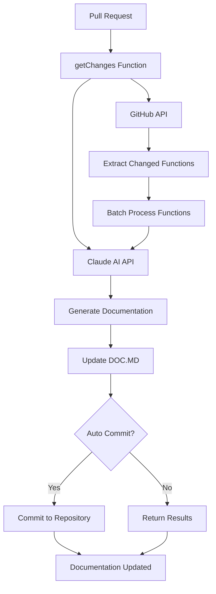
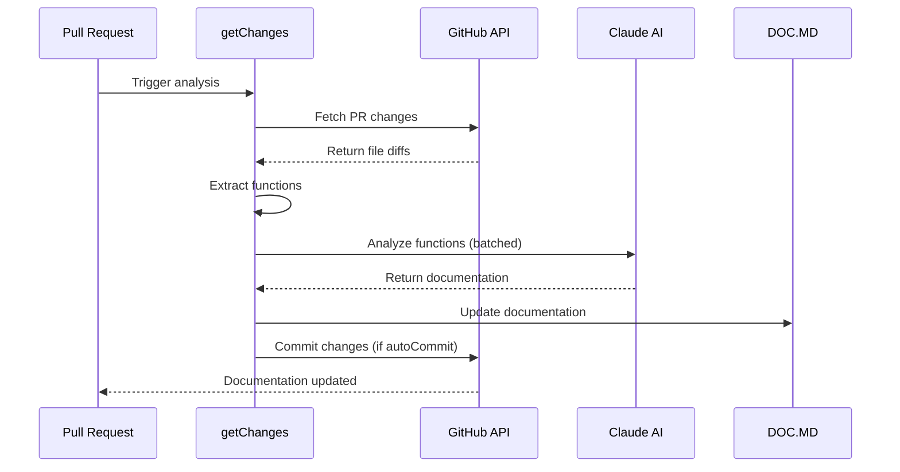

# Technical Documentation

## Function Reference

### Math Operations (`examples/math.js`)

#### `add(a, b)`
Adds two numbers and returns their sum.

**Parameters:**
- `a` (number): First operand
- `b` (number): Second operand

**Returns:** Number - The sum of a and b

#### `sub(a, b)`
Subtracts b from a and returns the difference.

**Parameters:**
- `a` (number): Minuend
- `b` (number): Subtrahend

**Returns:** Number - The difference (a - b)

#### `mul(a, b)`
Multiplies two numbers and returns their product.

**Parameters:**
- `a` (number): First factor
- `b` (number): Second factor

**Returns:** Number - The product of a and b

#### `div(a, b)`
Divides a by b and returns the quotient (returns Infinity if b is 0).

**Parameters:**
- `a` (number): Dividend
- `b` (number): Divisor

**Returns:** Number - The quotient (a / b), or Infinity if b is 0

### Core Server Functions (`src/server.ts`)

#### `getChanges(owner, repo, pull_number, anthropic_api_key, github_token, autoCommit?)`
Main function that analyzes GitHub pull requests to identify functions needing documentation updates. Uses Claude AI to generate comprehensive documentation and optionally commits changes back to the repository. Handles fork detection, batch processing of functions, and DOC.MD updates.

**Parameters:**
- `owner` (string): GitHub repository owner
- `repo` (string): Repository name
- `pull_number` (number): Pull request number to analyze
- `anthropic_api_key` (string): API key for Claude AI service
- `github_token` (string): GitHub authentication token
- `autoCommit` (boolean, optional): Whether to automatically commit documentation changes

**Returns:** Promise - Resolves when analysis and documentation updates are complete

## Usage Information

### Math Operations
The math functions provide basic arithmetic operations with standard JavaScript number handling. All functions expect numeric inputs and return numeric results.

```javascript
const result1 = add(5, 3);     // Returns 8
const result2 = sub(10, 4);    // Returns 6
const result3 = mul(7, 2);     // Returns 14
const result4 = div(15, 3);    // Returns 5
const result5 = div(10, 0);    // Returns Infinity
```

### Documentation Analysis
The `getChanges` function integrates with GitHub's API and Claude AI to automatically analyze pull requests and update documentation:

```typescript
await getChanges(
  'username',
  'repository-name',
  123,
  'anthropic-api-key',
  'github-token',
  true  // Auto-commit changes
);
```

## Setup & Installation

### Prerequisites
- Node.js runtime environment
- GitHub personal access token with repository permissions
- Anthropic API key for Claude AI integration

### Environment Configuration
Set the following environment variables:
```bash
GITHUB_TOKEN=your_github_token
ANTHROPIC_API_KEY=your_anthropic_key
```

### Dependencies
Ensure the following packages are installed:
- GitHub API client library
- Anthropic SDK
- TypeScript runtime (for server functions)

## Troubleshooting

### Math Operations
- **Division by zero**: The `div` function returns `Infinity` when dividing by zero, following JavaScript standards
- **Non-numeric inputs**: Functions may return `NaN` if non-numeric values are passed

### Documentation Analysis
- **API rate limits**: GitHub and Anthropic APIs have rate limits; implement appropriate delays between requests
- **Fork detection**: The system automatically detects if the PR is from a fork and adjusts commit behavior accordingly
- **Authentication errors**: Verify that GitHub tokens have sufficient permissions for the target repository
- **Large pull requests**: Function batching helps handle PRs with many changes, but very large PRs may require manual processing

## System Architecture



